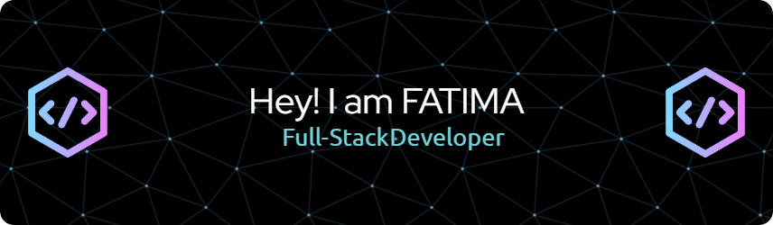

I'm a passionate software developer who loves transforming ideas into digital solutions. I love to think out of the box and love to take challenges. My strong problem-solving skills enable me to analyze complex problems and develop solutions. I believe self-growth and giving up is not an option for me.

* 🌍  I'm based in Pakistan
* ✉️  You can contact me at [Batoolfatima2135@gmail.com](mailto:Batoolfatima2135@gmail.com)
* 🚀  I'm currently working on [To-do-List App](http://batoolfatima2135.github.io/To-do-List-App/)
* 🧠  I'm learning Webpack
* 🤝  I'm open to collaborating on all my skill related projects

### Skills

### Socials

    

### Badges

<b>My GitHub Stats</b>

